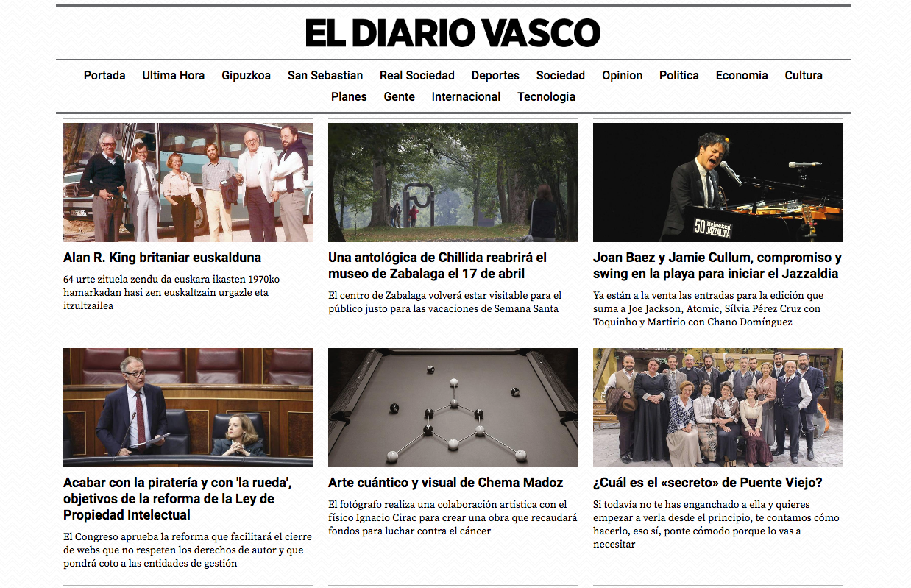
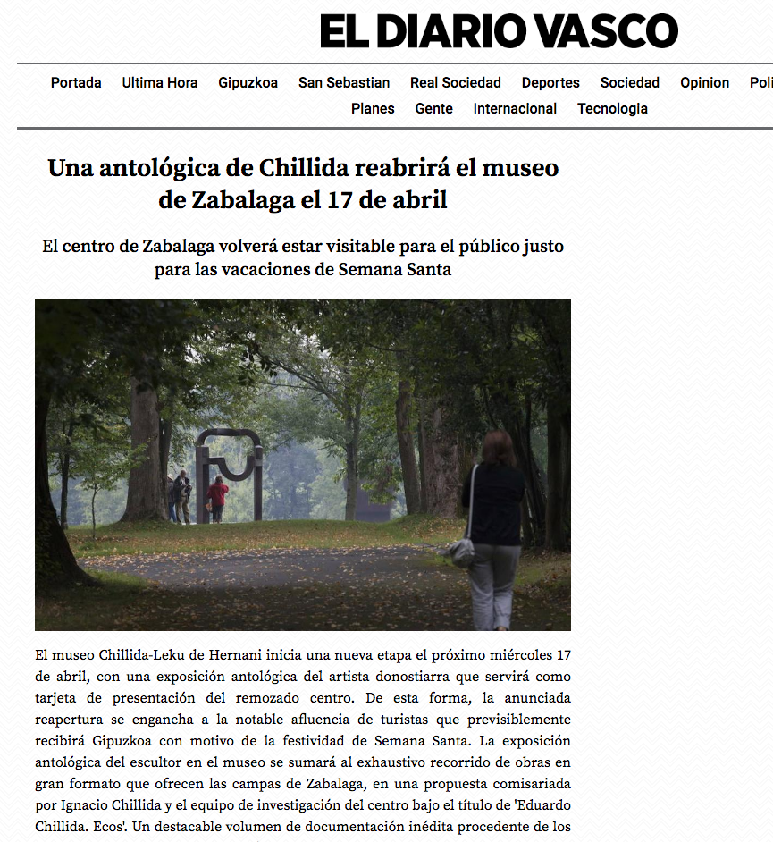

# newspaper-scraping

Open & free access to subscription-based regional newspaper through RSS + article scraping

### Why?

The [diariovasco](https://www.diariovasco.com/) is a regional newspaper from Gipuzkoa, in Spain.
The online version of the newspaper was open-access until 2017, but since then an over-priced subscription is necessary. 

Even though we usually read the national news through other mediums, we were missing lots of info about local matters. That is the reason why I set out to provide a open and free access to this regional newspaper.

Fortunately the articles are indexed through RSS every 30 minutes. The articles can be accessed, but the content is blocked by a pop-up, so I use a simple article scraper ([Newspaper3k](https://newspaper.readthedocs.io/en/latest/)) for extrating the title, subtitle, main image and text. Finally, a simple [Flask](http://flask.pocoo.org/) webpage was built to allocate the content and deployed on [Heroku](https://www.heroku.com/).

The final webpage looks like this (very basic design, but functional):
<kbd>
  
</kbd>
<kbd>
  
</kbd>

### Overview

- [Feedparser](https://pythonhosted.org/feedparser/) python library for parsing RSS feed
- [Flask](http://flask.pocoo.org/) as web framework
- [Newspaper3k](https://newspaper.readthedocs.io/en/latest/) python library for extracting & curating articles
- [Heroku](https://www.heroku.com/) for python hosting + deployment

### In detail

RSS from the newspaper is used as the source of information. The sections of interest are indicated in the json file *rss_data.json*:
```json
[
	{"url": "https://www.diariovasco.com/rss/2.0/?section=ultima-hora", "title":"Ultima Hora"},
	{"url": "https://www.diariovasco.com/rss/2.0/?section=gipuzkoa","title":"Gipuzkoa"},
	{"url": "https://www.diariovasco.com/rss/2.0/?section=san-sebastian","title":"San Sebastian"}
]
```

After importing this data, I set up the Flask server with the following html templates:

- *base.html* : shows the title of the newspaper and the available sections
- *section.html* : recent articles indexed on that section
- *article.html* : title, subtitle, main image and text of an article 

When an article is requested, it is downloaded and parsed to extract its content.


